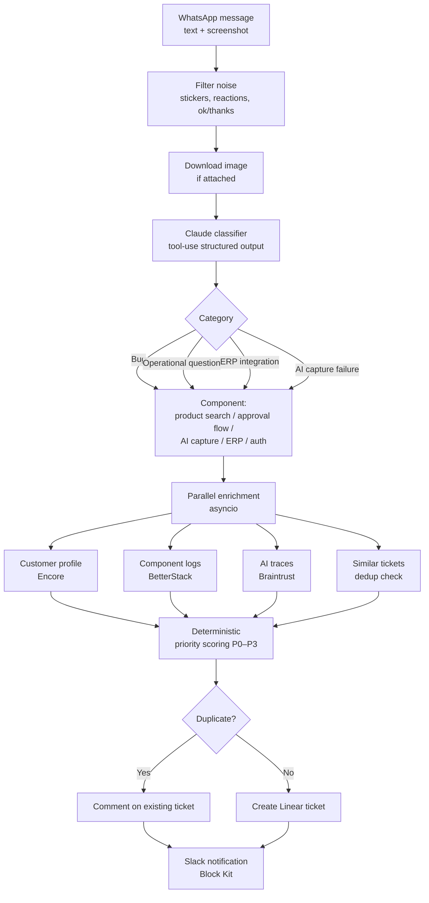

# sharpi-support-automation

> **AI-driven support triage for WhatsApp-based B2B operations.**
> Proof-of-concept that reduces support ticket handling from 15–30 minutes of human work to seconds, by automatically classifying, enriching, and routing customer messages.

> 📝 This repository is the PoC originally built as a technical case study for Sharpi. A production version is now being implemented internally. Example messages used here come from the case study and were authorized for public use.

---

## The problem

Sharpi is a B2B platform that automates WhatsApp ordering for distributors and industrial buyers. When something breaks, customers report it in WhatsApp support groups - usually as a screenshot, a vague description, or just *"it's broken."*

The manual flow today:

> Message arrives → Analyst reads it → Decides if it's a bug or a question → Hunts for context in logs → Creates a Linear ticket → Pings the right person

**15–30 minutes per message**, with real failure modes:

- Messages get lost across multiple support groups
- The same issue is reported in different groups without anyone noticing (duplicates)
- Priority decisions depend on subjective interpretation
- Gathering context across observability tools is slow and manual

---

## The solution

A layer between WhatsApp and the operations team that owns the entire triage flow.



### What it does, step by step

1. **Receives** the message at a FastAPI webhook (text, image, or both).
2. **Filters** non-support content first - stickers, reactions, audios, replies like *"ok"* or *"obrigada"* never make it past this stage.
3. **Downloads the screenshot** (if attached) and sends it together with the text to **Claude (Anthropic)**, which returns structured output via **tool-use**: category + affected component + extracted signals. No JSON parsing tricks, no orchestration framework - the schema is enforced by tool-use itself.
4. **Classifies** into 4 categories:
   - **Bug** — something is broken in production
   - **Operational question** — user doesn't know how to do something
   - **ERP integration** — issue on the customer's ERP integration
   - **AI capture failure** — issue on the AI-driven order capture
5. **Identifies the affected component** (product search, approval flow, AI capture, ERP integration, authentication).
6. **Enriches in parallel** (asyncio) from multiple sources:
   - Customer profile from Sharpi's internal backend (Encore) — plan, onboarding days, open tickets, production status
   - Recent logs of the affected component (BetterStack)
   - AI execution traces (Braintrust) when the issue is on the AI capture
   - Similar tickets for duplicate detection
7. **Calculates priority deterministically (P0–P3)** based on issue type, component weight, urgency signals, customer tier, and recurrence pattern. Not an LLM call — predictable and auditable.
8. **Creates the Linear ticket** via GraphQL (or comments on an existing one if it's a duplicate) with original message, classification, technical context, and priority breakdown.
9. **Posts a Slack card** with Block Kit so the team can act immediately.

In Phase 1, the customer reply on WhatsApp is still manual — the team reads the ticket and responds. Phases 2 and 3 close that loop (see [Roadmap](#roadmap)).

---

## Tech stack

| Layer | Tools |
|---|---|
| LLM | **Claude (Anthropic)** via official SDK, structured output via tool-use (no LangChain, no OpenAI) |
| Backend | **Python**, **FastAPI**, **asyncio**, **httpx** |
| Storage | **Postgres** (idempotency + feedback storage) |
| Messaging | WhatsApp Business API |
| Tickets | **Linear** (GraphQL) |
| Notifications | **Slack** (Block Kit) |
| Observability enrichment | Sentry, BetterStack, Braintrust |
| Internal data lookup | Encore (Sharpi backend, customer profile by phone) |
| Hosting | Railway / Fly.io |

---

## Run it locally

This repo ships two ways to try the system end to end:

**Visual demo (recommended) — Streamlit app**
```bash
streamlit run app.py
```
Step-by-step UI: incident input, triage in progress, before-and-after, suggested technical context, structured ticket, internal alert, and customer reply.

**Batch demo — CLI runner**
```bash
python main.py
```
Processes 4 real support messages from the case study and prints the full classification for each: category, component, title, priority, and score breakdown.

---

## Example inputs

The 5 real screenshots used as input come from the technical case and represent recurring real-world issues in Sharpi support:

- Product search hanging mid-query
- Order stuck in approval with no clear reason
- Recurring error when posting an order to the customer's ERP
- AI not identifying products during order capture
- Order creation failing silently with no error message

The full classification output is in the demo runner — you can see how the system handles ambiguity, identifies the affected component, and assigns priority for each case.

---

## Architecture

For the full picture — end-to-end flow, component responsibilities, deploy diagram, DB schema, classification taxonomy — see [`ARCHITECTURE.md`](./ARCHITECTURE.md).

---

## Roadmap

The system is being rolled out in three phases (production implementation in progress at Sharpi):

**Phase 1 — Automatic triage** *(this PoC + production in progress)*
Receives messages, classifies, enriches, creates a Linear ticket, and notifies Slack. The analyst's role shifts from "first interpreter" to "reviewer."

**Phase 2 — Closing the customer loop**
Auto-reply on WhatsApp when ticket is created and resolved, plus CSAT collection.

**Phase 3 — Self-service knowledge base**
Turn the ticket history into a Q&A bot that resolves common operational questions directly in WhatsApp — for the cases that don't need a human.

---

## Why this matters

| Before | After |
|---|---|
| 15–30 minutes per message | Seconds per message |
| Messages lost across groups | Every message captured and structured |
| Same issue reported separately | Duplicate detection across groups |
| Subjective prioritization | Deterministic, auditable P0–P3 |
| Manual context gathering | Auto-enriched with Sentry / BetterStack / Braintrust |

---

## About

Built by [Katrine Araldi](https://github.com/whoiskaah) — Solutions Engineer at Sharpi.

This repo is a public PoC. The production implementation lives in Sharpi's internal repository and uses real customer data, credentials, and proprietary integrations — those are not part of this version. The example messages used here were authorized by Sharpi for case-study use.

Happy to walk through the architecture or the live PoC on a call — feel free to reach out.

📧 [katrinearaldi@gmail.com](mailto:katrinearaldi@gmail.com) · [LinkedIn](https://www.linkedin.com/in/katrine-araldi)
